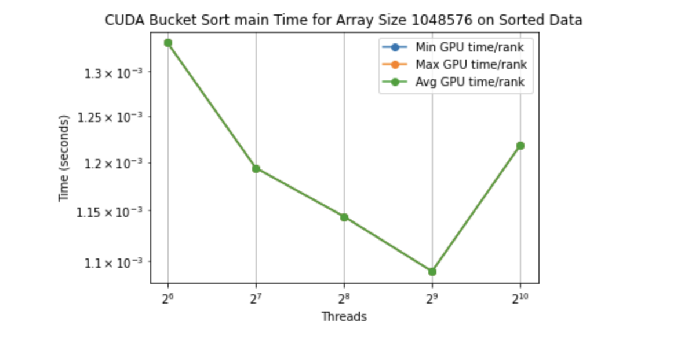
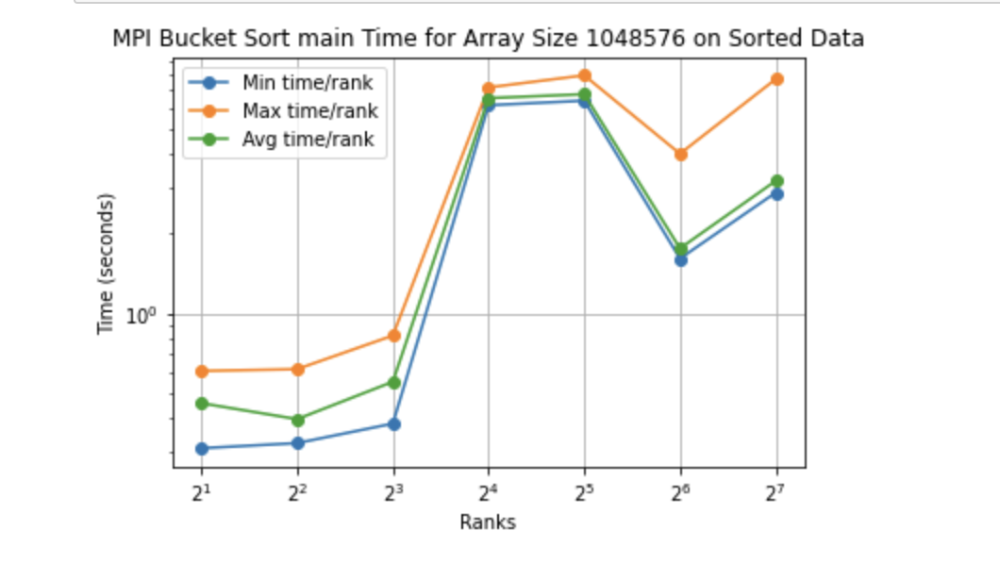

# CSCE 435 Group project

## 1. Group members:

1. Sam Hirvilampi
2. Eric Haddad
3. Nhi Vu
4. Irving Salinas

---

## 2a. _due 10/25_ Project topic

Parallelizing quicksort and merge sort using MPI and CUDA. Comparing performance between sequential, MPI, and CUDA implementations.

Meeting/Communication Details:

-GroupMe for written communication

-Weekly meetings at Zach to work on the project and put things together.

## 2b. _due 10/25_ Brief project description (what algorithms will you be comparing and on what architectures)

Implementing the following versions of each algorithm:

- Odd/Even Sort (MPI)
- Odd/Even Sort (CUDA)
- Merge sort (MPI)
- Merge sort (CUDA)
- Bucket Sort (MPI)
- Bucket Sort (CUDA)
- Counting Sort (MPI)
- Counting Sort (CUDA)

We will then compare performance metrics between these implementations.

Pseudocode:

---

Merge Sort (Sequential):

    if length of array is 1:
        return array

    leftArray = first half of array
    rightArray = second half of array

    left = MergeSort(leftArray)
    right = MergeSort(rightArray)
    result = []

    while left and right are not empty:
        if first element of left is less than first element of right:
            add first element of left to result
            remove first element from left
        else:
            add first element of right to result
            remove first element from right

    add rest of left to result
    add rest of right to result

    return result

---

---

Merge Sort (MPI):

    // Define the merge sort and merge functions
    function mergeSort(array, low, high)
        if low < high
            mid = low + (high - low) / 2
            mergeSort(array, low, mid)
            mergeSort(array, mid + 1, high)
            merge(array, low, mid, high)

    function merge(array, low, mid, high)
        // Merge two sorted subarrays array[low..mid] and array[mid+1..high]
        // Implementation details are omitted for brevity

    // Start of main program

    // Initialize MPI
    MPI_Init(&argc, &argv)
    MPI_Comm_rank(MPI_COMM_WORLD, &rank)
    MPI_Comm_size(MPI_COMM_WORLD, &size)

    // Split the data among processes
    if rank == 0
        // Master process: distribute data to other processes
        for i = 1 to size - 1
            data_to_send = split_data(i)
            MPI_Send(data_to_send, data_to_send_size, MPI_INT, i, tag, MPI_COMM_WORLD)
    else
        // Worker process: receive data from master process
        MPI_Recv(data, data_size, MPI_INT, 0, tag, MPI_COMM_WORLD, &status)

    // Start computation time
    start_time = getCurrentTime()

    // Perform the merge sort
    mergeSort(data, 0, data.length - 1)

    // End computation time
    end_time = getCurrentTime()
    computation_time = end_time - start_time

    // If not master process, send the sorted data back to master
    if rank != 0
        MPI_Send(data, data_size, MPI_INT, 0, tag, MPI_COMM_WORLD)

    // If master process, receive sorted data from all worker processes and merge
    if rank == 0
        for i = 1 to size - 1
            MPI_Recv(sorted_data, data_size, MPI_INT, i, tag, MPI_COMM_WORLD, &status)
            // Merge current sorted data into the final sorted array
            merge(final_sorted_array, 0, final_sorted_array.length - 1, sorted_data.length)

    // Start communication time
    start_comm_time = getCurrentTime()

    // Finalize MPI
    MPI_Finalize()

    // End communication time
    end_comm_time = getCurrentTime()
    communication_time = end_comm_time - start_comm_time

    // Amount of data sent
    amount_of_data_sent = sizeof(data) * data_size

---

---

Merge Sort (CUDA):

    function mergeSortGPU(array, size){
        //Start recording time

        //Allocate device memory and copy the input array
        device_array = allocateDeviceMemory(size)

        //Launch quicksort kernel
        mergeSortKernel<<<1, 1>>>(device_array...)
        synchronizeDevice()

        //Copy sorted array to host
        copyArrayToHost()

        //Stop recording time
    }

    function mergeSortKernel(array, left value, right value){
        if length of array is 1:
            return array

        leftArray = first half of array
        rightArray = second half of array

        left = mergeSortKernel(leftArray)
        right = mergeSortKernel(rightArray)
        result = []

        while left and right are not empty:
            if first element of left is less than first element of right:
                add first element of left to result
                remove first element from left
            else:
                add first element of right to result
                remove first element from right

        add rest of left to result
        add rest of right to result

    return result

    }

    function main(){
        //Call mergeSortGPU() with the array and size
        mergeSortOnGPU(array, size)
        //Output the array
    }

---

---

Odd/Even Sort (MPI):

    // Define the quick sort and partition functions
    function quickSort(array, low, high)
        if (low < high)
            pi = partition(array, low, high)
            quickSort(array, low, pi - 1)
            quickSort(array, pi + 1, high)

    function oddEvenSort(arr, n) {
    while (!isSorted) {
        for (int i = 1; i <= n - 2; i = i + 2) {
            if (arr[i] > arr[i + 1]) {
                swap(arr[i], arr[i + 1]);
            }
        }

        for (int i = 0; i <= n - 2; i = i + 2) {
            if (arr[i] > arr[i + 1]) {
                swap(arr[i], arr[i + 1]);
            }
        }
      }
    }

    // Start of main program

    // Initialize MPI
    MPI_Init(&argc, &argv)
    MPI_Comm_rank(MPI_COMM_WORLD, &rank)
    MPI_Comm_size(MPI_COMM_WORLD, &size)

    // Split the data among processes
    if rank == 0
        // Master process: distribute data to other processes
        for i = 1 to size - 1
            data_to_send = split_data(i)
            MPI_Send(data_to_send, data_to_send_size, MPI_INT, i, tag, MPI_COMM_WORLD)
    else
        // Worker process: receive data from master process
        MPI_Recv(data, data_size, MPI_INT, 0, tag, MPI_COMM_WORLD, &status)

    // Start computation time
    start_time = getCurrentTime()

    // Perform the quick sort
    oddEvenSort(data, 0, data.length - 1)

    // End computation time
    end_time = getCurrentTime()
    computation_time = end_time - start_time

    // If not master process, send the sorted data back to master
    if rank != 0
        MPI_Send(data, data_size, MPI_INT, 0, tag, MPI_COMM_WORLD)

    // If master process, receive sorted data from all worker processes
    if rank == 0
        for i = 1 to size - 1
            MPI_Recv(sorted_data, data_size, MPI_INT, i, tag, MPI_COMM_WORLD, &status)
            merge sorted_data into final_sorted_array

    // Start communication time
    start_comm_time = getCurrentTime()

    // Finalize MPI
    MPI_Finalize()

    // End communication time
    end_comm_time = getCurrentTime()

    communication_time = end_comm_time - start_comm_time

    // Amount of data sent
    amount_of_data_sent = sizeof(data) * data_size

---

---

Odd/Even Sort (CUDA):

    function oddEvenSortGPU(array, size){
        //Start recording time

        //Allocate device memory and copy the input array
        device_array = allocateDeviceMemory(size)

        //Launch quicksort kernel
        oddEvenSortKernel<<<1, 1>>>(device_array...)
        synchronizeDevice()

        //Copy sorted array to host
        copyArrayToHost()

        //Stop recording time
    }

    function oddEvenSort(arr, n) {
        while (!isSorted) {
            for (int i = 1; i <= n - 2; i = i + 2) {
                if (arr[i] > arr[i + 1]) {
                    swap(arr[i], arr[i + 1]);
                }
            }

            for (int i = 0; i <= n - 2; i = i + 2) {
                if (arr[i] > arr[i + 1]) {
                    swap(arr[i], arr[i + 1]);
                }
            }
          }
        }

    function main(){
        oddEvenSortGPU(array, size)
        //Output the array
    }

---

---

Counting Sort (MPI):

    function countingsort(int* arr, int n, int max_value) {
      int rank, size;
      MPI_Comm_rank(MPI_COMM_WORLD, &rank);
      MPI_Comm_size(MPI_COMM_WORLD, &size);

      // Initialize a count array
      int local_count[max_value + 1];
      for (int i = 0; i <= max_value; i++) {
          local_count[i] = 0;
      }

      // Count elements in the subarray
      for (int i = local_start; i <= local_end; i++) {
          local_count[arr[i]]++;
      }

      // Gather local counts into global array
      int global_count[max_value + 1];
      MPI_Allreduce(local_count, global_count, max_value + 1, MPI_INT, MPI_SUM, MPI_COMM_WORLD);

      // Construct sorted array
      for (int i = local_start, j = 0; j <= max_value; j++) {
          while (local_count[j] > 0) {
              arr[i] = j;
              i++;
              local_count[j]--;
          }
      }

      }

---

---

Counting Sort (CUDA):

    function countingSort(int* inputArray, int* outputArray, int arraySize, int maxValue) {

      // Allocate device memory for input and output arrays
      allocateDeviceMemory(inputArray, outputArray, arraySize, d_inputArray, d_outputArray);

      // Initialize shared count array for each block
      int* countArray = initializeCountArray(maxValue);

      // Count elements in each block
      countElementsInBlocks(d_inputArray, arraySize, countArray, maxValue);

      // Compute prefix sum in the shared count array

      // Update the output array with sorted elements
      updateOutputArray(d_inputArray, d_outputArray, arraySize, countArray);

      // Copy the sorted data from device to host
      copyDataToHost(d_outputArray, outputArray, arraySize);

}

## 2c. Evaluation plan - what and how will you measure and compare

- Input sizes: 20
- Input types: integer
- Strong scaling (same problem size, increase number of processors/nodes): we will increase the number of processors for the same array size
- Weak scaling (increase problem size, increase number of processors): We will increase both the array size and the number of processors
- Number of threads in a block on the GPU: We will test to run 2,4,8,16 threads in CUDA

## 3. Project Implementation

# Bucketsort MPI

---

    In the parallel version of this algorithm implemented with MPI, the process is divided among multiple processes. Here's how it works:

    Data Initialization: The root process (rank 0) initializes an array with random integers and adds padding if the array cannot be evenly divided among the available processes.

    Data Distribution: The root process scatters the array to all processes using MPI's scatter function. Each process receives a chunk of the array.

    Local Sorting: Each process sorts its local chunk of data using the bucket sort algorithm. The maximum value in each local chunk is used to determine the number of buckets. Each element is placed into a bucket, and then each bucket is sorted.

    Data Gathering: The sorted data from each process is gathered back in the root process using MPI's gather function.

    Final Sorting: The root process then sorts the gathered data using the bucket sort algorithm again to ensure complete sorting.

    Correctness Check: A function checks if the final array is sorted correctly by verifying that each element is less than or equal to the one that follows it.

    Throughout the algorithm, Caliper is used to time the computation and communication parts separately. The "comm" regions cover the MPI communication functions (scatter and gather), and the "comp" regions cover the computation function (bucket sort). This allows detailed performance measurements to be taken.

---

# Counting Sort MPI

---

    Using MPI to parallelize the counting sort algorithm requires multiple processes such as the following:
    Initialization: MPI figures out how many processes there are and generates an array on the root process which is Rank = 0.

    Data Distribution: The array is divided evenly among the number of processes and each process will independently sort its chunk. Padding is added if the array is not evenly divisble.

    Counting/Sorting Step: Each process will execute the countsort() function on its own chunk locally. Counting arrays are used to keep track of the number of unique element occurrences.

    Data Gathering: After each process has sorted its respective chunk, the chunks are stitched together by the root process at Rank = 0.

    Sources: The skeleton of the MPI code is used from lab 2. The counting sort function/algorithm is referenced from this GeeksForGeeks implementation:     https://www.geeksforgeeks.org/counting-sort/. It is slightly modified to fit our implementation.

---

# Odd Even Sort MPI

---

    Using MPI to parallelize the counting sort algorithm requires multiple processes such as the following:

    Initialization: The program calculates how many chunks to create based on the size of the array and the number of processes entered by the user.

    Data Distribution: MPI evenly divides the data among the chunks in preparation for the actual sorting.

    Sorting Step: Each process will execute the oddEvenSort() function on its own chunk.

    Data Gathering: After all of the chunks have been sorted, the root process combines the results together into the final array.

    Sources: The skeleton of the MPI code is adapted from lab 2. The MPI algorithm was developed with help from https://www.geeksforgeeks.org/implementation-of-quick-sort-using-mpi-omp-and-posix-thread/. I adjusted the algorithm to fit my specific needs, but took information from their implementation. I developed the odd even sort algorithm on my own.

---

# Odd Even Sort CUDA

---

    Using CUDA to parallelize the counting sort algorithm requires multiple processes such as the following:

    Initialization: The program calculates how many chunks to create based on the size of the array and the number of processes entered by the user.

    Data Distribution: The program creates multiple kernels and sends different parts of the data to each kernel. The kernels then sort and communicate the results back.

    Sorting Step: Each process will execute the oddEvenSort() function on its own chunk.

    Data Gathering: After all of the chunks have been sorted, the root process combines the results together into the final array.

    Sources: The skeleton of the CUDA code is adapted from lab 3.

---

# Mergesort MPI

---

Initialization:Begin by determining the array's size and the user-input number of processes. Compute the number of chunks each process handles, considering the array size and the specified  
 processes.Initialize MPI and obtain the rank and size of the MPI communicator.

Data Distribution:Distribute the input array among processes using MPI's scatter operation.Ensure each process is informed about its chunk size and the starting index in the global array.

Sorting Step:Execute a local counting sort on each process's designated array chunk.Local counting sort involves tallying occurrences of elements within the chunk and updating the chunk accordingly.

Data Gathering:Assemble all sorted chunks at the root process using MPI_Gather.The root process consolidates the sorted chunks, creating the final sorted array.

Sources: The skeleton of the MPI code is adapted from lab 2. The mergesort algorithm was developed with help from https://www.geeksforgeeks.org/merge-sort/. I adjusted the algorithm to fit my specific needs, but took information from their implementation.

---

## 4. Performance Evaluation

# Bucketsort

1. For the implementation using CUDA, I have calculated the results using strong scaling and it has shown that as the number of threads increase, the average GPU time to run main has went down. Except for when the number of threads passed 1024, which represent the capped for the sorting algorithm and that 512 threads would be take the least amount of time to sort a random array using bucket sort. However, Bucket Sort wasn't able to parallelized using the GPU, so I have tried to implement the code for CUDA similar to MPI.

2. For the implementation using MPI, I have calculated the results using strong scaling and it has shown that as the number of processes increase, the amount of time to run the algorithm also increased. There was also a dip at 64 processes and increase the time again at 128 processes.

# Counting Sort

1. For the CUDA implementation, I graphed the results for 2^20 "random" values for 64, 128, 256, 512, 1024 threads using strong scaling. As we can see in the graph, time decreased as we added more threads except for 256 threads. I ran the job twice with 256 threads and both times there was a spike. The best performance was at 1024 threads and worst performance was at 64 threads. I believe there may have been a limitation relating to the block size and threads specifically at 256 threads.

2. For the MPI implementation, I got an unexpected result after performing strong scaling using arrays of size 2^20 "Random" for all thread counts. In my graph we can see that performance got worse as we added more threads. We saw slight improve from 2 to 4 processes, however, beyond 4 processes performance suffered. This may be because 2^20 is a smaller array size. There can be other issues as well with how counting sort reacts with MPI.
   

# Odd/Even Sort

1. For the CUDA implementation of Odd/Even sort, I've tested it by running the program with 256, 512, and 1024 threads. With my strong scaling studying, we see that the time to run the program decreases for a given size as we increase the number of threads. This means that the program is efficiently parallelizing. For weak scaling, when the number of threads and number of values are increased by a consistent amount, the time it takes to execute increases. 

2. For the MPI implementation of Odd/Even sort, I've tested it by running the program with 2, 4, 8, 16, 32, 64, 128, 256, and 512 processes over numerous array sizes. Similar to CUDA, the strong scaling study shows that as we increase the processes, the running time of the program decreases for a constant array size. Additionally, for weak scaling, the time it takes to execute the program increases even when the number of processes and number of values are increased consistently. 
   

# Merge Sort

1. For the MPI implementation of Merge sort, I've tested it by running the program with 2, 4, and 8 threads with an array size of 2^20. With my strong scaling studying, we can see that it ran the fastest with this specific array size when it had 4 threads and slightly slowed down when we gave it 8. This probably is not the norm but it will probably change once we give it a bigger array size.

2. For the CUDA implementation of Merge sort, I've tested it by running the program with 2, 4, 8, 16 processes over the array size of 1024. I was not able to get the graph due to thicket issues but from the output I was able to see that it was successful and that it got faster when more processes where added which is what strong scaling study would show.

## 5. Presentation

Comparison Graphs: https://github.com/EricHaddad/435-Project/blob/master/Comparison%20Graphs.pdf

Odd Even Sort Graphs: https://github.com/EricHaddad/435-Project/blob/master/Odd%20Even%20Sort%20Graphs%20(1).pdf

Counting Sort Graphs: https://github.com/EricHaddad/435-Project/blob/6d2632f8e5379d8633578230cbb14e2acfac9ca1/Counting_Sort_Graphs.pdf

Bucket Sort Graphs: https://github.com/EricHaddad/435-Project/blob/master/Bucket%20Sort%20Graphs.pdf

Merge Sort Graphs: https://github.com/EricHaddad/435-Project/blob/master/MergeSort_Graphs.pdf

## 6. Final Report Analysis

### Bucket Sort:
The CUDA graphs and implementation was poorly optimized because Bucket Sort cannot be parallelized by CUDA, so I have implemented CUDA method similar to MPI and perform CUDA kernel and sorting computation in comp_large.

### Counting Sort Implementation & Analysis:
**-MPI-**

For the MPI implementation, I parallelized the sort algorithm using the divide-and-conquer strategy. The input array gets divided into equal chunks and the processes are assigned
to those chunks to have equivalent workloads. Each chunk is sorted sequentially and then the sorted chunks are merged by the root process. This is done using MPI Scatter and Gather.

For MPI, the computation time weak scaled relatively well however the communication had some interesting behavior where the two largest array sizes weak scaled well but the smaller array sizes did not weak scale well. Overall for MPI, we did not see benefits from parallelization. The speedup was around 1 or less meaning there was no benefit. One bottleneck I believe occurred was that I misunderstood the number of nodes needed for each processor amount. I was under the interpretation that 1 node is 48 cores which is 96 threads so 1 node would be enough for up to 64 processes. And I was allocating nodes based on the ceiling of # processes / 96.
The computation time did not strong-scale as a result of this and the time increased with processes. Communication overhead was also overwhelming the total time of the whole algorithm which hurt the speed up.
The best input type for this implementation was random as it had the smallest computation time although it did have higher communication time as well. There was no "best process" number but the implementation suffered quite a bit after 32 processes partially due to not allocating enough nodes.

**-CUDA-**

For the CUDA implementation, I parallelized the kernel by creating a thread index and a block index to calculate the global index of the element each thread should process. In this implementation, each thread in the GPU is responsible for processing one element of the input array. The kernel also uses atomicAdd to perform atomic increments on the corresponding element in the output array. Since counting sort is inherently recursive, it doesn't require recursion in the code. 

For CUDA, we did see slight strong-scaling for computation time on the smaller array sizes but after 2^18 we no longer strong-scaled well. Communication weak-scaled well but computation again did not weak-scale very well. Since CUDA does not have the same level of communication overhead as MPI, we can see communication stayed consistent among thread counts. Perturbed did take the most amount of time in terms of communication. The best input type for this implementation was sorted. It had the lowest computation times and low communication time. Similarly to MPI, the smallest array size had the best speedup for random input type but there was no clear winner overall since speedup was very different for each input type. Overall, CUDA experienced very little to no speedup as well. The bottleneck for CUDA is most likely in the kernel where atomicAdd is being used and the global index is being calculated. Both of those operations limit parallelization.

**-Summary-**

Counting Sort did not experience benefits from parallelization. A big reason for this is that Counting Sort requires global communication and synchronization across threads/processes which is very expensive. A bottleneck that needs to be considered with Counting Sort is that it can only sort integers and if the range of integers is large, it will hurt performance. For my implementations, I kept the range from 0 to 99. Although Counting Sort does have some inherent parallelism in some areas such as generating the counting array, it is not the best option available.

**-Sources-**

For MPI, the counting sort algorithm itself is sequential. I got the source code for the implementation from geeksforgeeks: https://www.geeksforgeeks.org/counting-sort/
For CUDA, in addition to the geeksforgeeks site, I used the NVIDIA forums here: https://forums.developer.nvidia.com/t/counting-sort/17984. For the kernel implementation, I also referenced this implementation from github to understand the kernel structure but did not copy this code. Modified it for my needs: https://github.com/marcoplaitano/counting-sort-cuda/blob/master/src/main.cu

